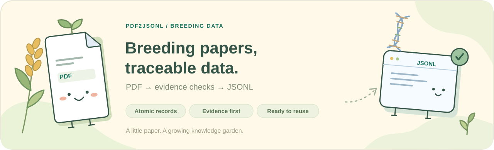
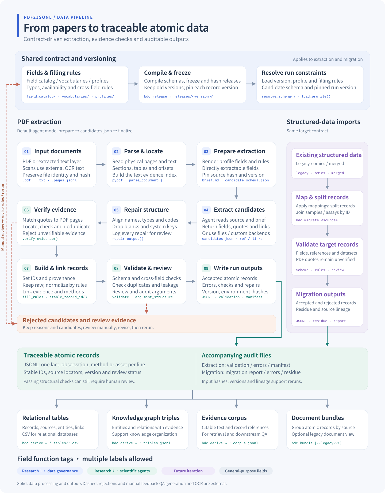

# 🌾 pdf2jsonl

[简体中文](README.md) | **English**



A data contract and extraction toolkit for **breeding literature**. Turn papers into atomic JSONL records with
traceable evidence, explicit field definitions, and versioned validation rules, then derive a knowledge graph,
a corpus, QA seeds and relational tables from the same records.

<table>
<tr>
<td align="center" width="25%">
<a href="https://atoz03.github.io/pdf2jsonl/papers.html"><br><strong>Paper dashboard</strong></a><br><sub>Papers & run history</sub>
</td>
<td align="center" width="25%">
<a href="https://atoz03.github.io/pdf2jsonl/#fields"><br><strong>Field guide</strong></a><br><sub>Definitions & examples</sub>
</td>
<td align="center" width="25%">
<a href="https://atoz03.github.io/pdf2jsonl/pipeline.html"><br><strong>Pipeline map</strong></a><br><sub>From PDF to records</sub>
</td>
<td align="center" width="25%">
<a href="#quick-start"><br><strong>Start extracting</strong></a><br><sub>Run your first paper</sub>
</td>
</tr>
</table>

> 🌱 The repository maintains the data contract; the Skill runs extraction; every record keeps its source.

**Everything is shown in one site:** [https://atoz03.github.io/pdf2jsonl](https://atoz03.github.io/pdf2jsonl/), built by `scripts/make_site.py` from the
latest release and the checked-in examples, and deployed from `main`.

| Page | What it shows |
| --- | --- |
| [Overview](https://atoz03.github.io/pdf2jsonl/) | How papers and existing data become records and how records are consumed; releases, groups, rules |
| [Field catalog](https://atoz03.github.io/pdf2jsonl/#fields) | All **404 fields**: meaning, type, JSON example, key role, functions, multi-select tags, origin |
| [PDF → JSONL demo](https://atoz03.github.io/pdf2jsonl/#demo) | The synthetic paper end to end: candidates, evidence verification, records, evidence-chain audit |
| [Downstream outputs](https://atoz03.github.io/pdf2jsonl/#downstream) | Statements, knowledge graph, annotated corpus, QA seeds and tables derived from the same records |
| [Papers](https://atoz03.github.io/pdf2jsonl/papers.html) | Paper dashboard: PDF, records of each run, evidence, review issues, downloads (UI in Chinese) |
| [Importers](https://atoz03.github.io/pdf2jsonl/#importers) | The legacy, omics and merged importers: mapping coverage, example runs, issue registers |
| [Pipeline](https://atoz03.github.io/pdf2jsonl/pipeline.html) | The pipeline diagram, in Chinese and English, with SVG download |

Preview locally with `make site` and open `_site/index.html`. `make dashboard` also writes an untracked
`dashboard.html` that includes papers and runs from local directories such as `out/`.

## 🧭 Extract once, consume many times

```
paper (PDF) ── pdf2jsonl ───┐                            ┌─► statements · triples · graph   (knowledge graph)
                            ├─► records (JSONL, hooks) ──┼─► corpus with entity offsets
existing data ─ bdc migrate ┘        bdc derive          ├─► cloze QA seeds
                                                         └─► relational tables (CSV)
```

A record is not a container for extraction results; it is the intermediate form every consumer shares. A
knowledge graph needs triples, so a record has an explicit subject, predicate and object. A corpus and a QA set
need to know where an entity stands in the text, so a record has the character offsets of every entity mention
and its role in the relation. No consumer parses the text a second time:

- **The model copies**: the three verbatim parts of a statement (`transform.subject_mention`,
  `predicate_mention`, `object_mention`).
- **The pipeline computes**: entity types, the offsets of entities and predicate in the quote, subject/object
  roles (`transform.entity_links`, `predicate_start_offset` / `predicate_end_offset`), and a relation code derived
  deterministically from a cue lexicon (`predicate_code`).
- **Reviewers and later stages add**: the reviewed predicate, entity alignment, natural-language QA. Each has
  its own field and is never mixed with extraction output.

Where a record has no hook, the derived output has no row: nothing is guessed. Design notes:
[`docs/downstream.md`](docs/downstream.md).

## 🧬 Data pipeline overview

[](docs/diagrams/pipeline.en.svg)

[HTML source](docs/diagrams/pipeline.html) · [Full-size SVG](docs/diagrams/pipeline.en.svg) · [Architecture](docs/architecture.md)

The diagram covers PDF extraction, imports of existing data, rejection and manual review paths, and the outputs:
relational tables, a knowledge graph, an evidence corpus with QA seeds, and document bundles. The HTML switches
languages and downloads the SVG. Run `make diagram` to regenerate both README images after editing the source.

## 📚 Inside the repository

| Path | What it is |
| --- | --- |
| `field_catalog/field_catalog.yaml` | **Canonical catalog**: every field, type, availability code, rule and ambiguity |
| `vocabularies/` | Controlled vocabularies and the deterministic unit table |
| `profiles/` | Field selections for one use case (`full`, `compact`, `pdf_extraction`, `pdf_extraction_omics`) |
| `releases/` | Frozen, hash-verified contract versions and `index.json` (`latest` pointer) |
| `schemas/meta/` | JSON Schemas for the source files themselves (catalog, vocabulary, profile, mapping) |
| `schemas/runtime/` | JSON Schemas for run outputs (manifest, validation report, error records, bundle, migration report) |
| `mappings/` | Leaf-by-leaf mappings from existing data formats to the contract, with issue registers; used by `bdc migrate` |
| `sources/` | Immutable original inputs (see `sources/SOURCES.md`) |
| `src/breeding_contract/` | Contract tooling: compile, release, resolve, validate, import, bundle, derive, audit (`bdc` CLI) |
| `skills/pdf2jsonl/` | The Skill: `SKILL.md`, extraction brief template, runtime (`scripts/pdf2jsonl`) |
| `docs/` | Architecture, versioning, source analysis, importers, downstream outputs, key roles and functions; `docs/generated/` is built from the catalog (including the [field reference](docs/generated/field_definitions.md)) |
| `docs/field_examples.yaml` | Curated illustrative values used to generate and validate the field reference |
| `docs/field_classification.yaml` | Per-field multi-select tags: Research Content 1, Research Content 2, future iteration, and general-purpose fields |
| `scripts/make_site.py` / `site/` | Site builder and page templates: contract browser, paper dashboard (`scripts/make_dashboard.py`), downstream outputs, importers |
| `examples/` | Synthetic paper, curated records, pipeline output, importer output, invalid cases |
| `tests/` | pytest suite (catalog fidelity, releases, validation, pipeline, Skill sync, importers, bundles, functions, evidence chain, downstream hooks, site) |

## 🔬 Contract at a glance (3.4.0)

- 404 fields in five groups: `common` 177, `agent` 57, `skills` 53, `transform` 49, `omics` 68.
  The 259 v3.0.0 fields are `verified` and verbatim; the 145 fields added since are `provisional`.
- **Multi-select functional tags**: Research Content 1, Research Content 2, future iteration, and general-purpose fields.
- Every key states **what it does** (`key_role`, 25 roles with their projection into graph, tables, triples and
  QA/corpora) and **which function it serves** (`serves`): Topic 2 agent, Topic 3 skills, derivation into
  KG / relational DB / QA / corpus / triples, and our own iteration (Topic 1). Topic 2/3 fields also name their
  card, and evidence-chain fields their Toulmin/Flavell element (after TRACE). Functions stated by the source
  are kept apart from repository additions. See `docs/field_functions.md`.
- Nested records: the field `common.record_id` is `{"common": {"record_id": ...}}`.
- Availability codes are semantics, not quality: **D** direct extraction, **N** normalized by rules,
  **I** human judgement, **G** generated later, **F** future source. Requirement codes **Y / C / N**.
- Missing information is **omitted**: no `null`, no empty string, no empty array or object.
- Every record carries `common.schema_name` and `common.schema_version`, a stable `common.record_id`
  (`rec_` + 32 hex), provenance (`source_id`, `source_locator`, page and verbatim quote for paper evidence),
  and a `review_status`.
- 34 cross-field rules (20 errors, 14 warnings): explicit source statements are errors, inferred ones are warnings only.
- 38 ambiguities are registered in the catalog (`AMB-001` … `AMB-038`) instead of being silently decided.

See the [online field catalog](https://atoz03.github.io/pdf2jsonl/#fields), [field definitions and examples](docs/generated/field_definitions.md), the
[detailed dictionary](docs/generated/field_dictionary.md) (also [CSV](docs/generated/field_dictionary.csv);
`bdc generate --xlsx out.xlsx` for Excel), and
[field functions](docs/generated/field_functions.md) (every key by function, with its role and facets).

<a id="quick-start"></a>

## 🌱 Quick start

```bash
uv venv .venv && uv pip install --python .venv/bin/python -e '.[dev]'   # or: pip install -e '.[dev]'
make check        # bdc check --strict
make test         # pytest
```

### 🧪 Extract a paper (agent mode)

```bash
skills/pdf2jsonl/scripts/pdf2jsonl paper.pdf --profile pdf_extraction --schema-version latest --out-dir out/
# exit 3: out/paper.work/ holds brief.md, pages.txt, candidate.schema.json, request.json
# write out/paper.work/candidates.json following brief.md, then run the same command again:
skills/pdf2jsonl/scripts/pdf2jsonl paper.pdf --profile pdf_extraction --schema-version latest --out-dir out/
```

Outputs: `paper.jsonl` (records), `paper.validation.json`, `paper.errors.jsonl` (rejected candidates, never
written as records), `paper.manifest.json` (contract identity, input hash, backend, environment, output hashes);
`--bundle` adds `paper.bundle.json`. The validation report includes `argument_structure`, the evidence-chain audit
(which statements are linked to data and methods, and which hedges or links are missing). Other backends: `--candidates file.json`, `--backend mock`,
`--backend module:callable`.

To make the Skill available to Claude Code in this repository, `.claude/skills/pdf2jsonl` links to
`skills/pdf2jsonl`; for a user-level install, symlink `~/.claude/skills/pdf2jsonl` to the same directory.

### Python API

```python
from breeding_contract import resolve_schema, load_profile, load_field_catalog, validate_record

rc = resolve_schema("latest")                  # or "3.0.0", or "dev" (unreleased working tree)
profile = load_profile("pdf_extraction", "latest")
catalog = load_field_catalog("3.4.0")
result = validate_record(record)               # validates against the version the record declares
result.valid, [i.to_dict() for i in result.errors]
```

### `bdc` CLI

| Command | Purpose |
| --- | --- |
| `bdc check [--strict]` | Consistency gate: catalog, profiles, releases, freshness, docs, examples, mappings, Skill |
| `bdc generate [--xlsx F]` | Rebuild `docs/generated/` from the catalog and documentation examples |
| `bdc release` | Freeze the working tree as `releases/<VERSION>` (needs a CHANGELOG entry) |
| `bdc resolve [--schema-version V] [--profile P]` | Print a version's identity (default `latest`) |
| `bdc validate FILE.jsonl` | Validate records (each against its declared version) plus dataset rules |
| `bdc diff A B` | Field-level diff between two versions |
| `bdc migrate legacy\|omics\|merged F --out DIR [--page-offset N]` | Import existing data as atomic records, see [Import existing data](#import) |
| `bdc bundle F.jsonl [--legacy-v1]` | Derive the per-document view (or the legacy v1 layout) from records |
| `bdc derive F.jsonl --out DIR` | Function 3: relational tables (CSV), statements, triples and a property graph, an annotated corpus and QA seeds |
| `bdc audit F.jsonl [--json]` | Evidence-chain audit (Toulmin/Flavell elements, link closure, review flags; no score) |

## 🌿 Evolving the contract

1. Edit `field_catalog/field_catalog.yaml` (and vocabularies/profiles). Keep source references; mark new
   semantics `provisional` and register open questions as ambiguities.
2. Bump `VERSION` per `docs/versioning.md` and add a `CHANGELOG.md` entry.
3. Add or update illustrative values in `docs/field_examples.yaml` and functional tags in `docs/field_classification.yaml`; contract name and version examples are generated automatically.
4. `bdc generate && bdc release && bdc check --strict && pytest`. Generation checks that every field has an example and that examples match field schemas.
5. The Skill needs no edit: its next run resolves `latest` and renders the brief from the new release.
   `bdc check` fails if the Skill hard-codes field paths or versions, or if a profile needs a fill rule the
   Skill does not implement.

<a id="import"></a>

## 🌾 Import existing data

Data that already exists in another shape enters the same contract through an importer, not through a second
schema. Each importer follows a leaf-by-leaf mapping (`mappings/`) and produces the same atomic records as
extraction, validated the same way.

| Command | Input | Example |
| --- | --- | --- |
| `bdc migrate legacy` | Document-level JSONL, one paper per line | `sources/legacy_v1/breeding_jsonl_example.jsonl` |
| `bdc migrate omics` | Filled instances of the multi-omics metadata template | `examples/migration/omics_v2/synthetic_deg_instance.json` |
| `bdc migrate merged` | Documents with observation, sample, assay and asset arrays joined by explicit IDs | `sources/merged_v2/breeding_jsonl_example_v2.json` |

```bash
bdc migrate merged sources/merged_v2/breeding_jsonl_example_v2.json --out out/merged --page-offset 2220
```

`--page-offset` converts journal pages to physical PDF pages; `2220` applies only to this example, and `0` means
the pages are already physical. All three importers write the same outputs: valid records, rejected candidates
with reasons, unconverted source content (residue) and a hashed migration report. Nothing is dropped silently
and nothing is invented to fill a required field. Imported records start as `pending_review`. See
`docs/migration.md` for the importers and `docs/source_analysis.md` for how the sources differ.

## 🗂 Documentation

- `docs/downstream.md` — the record as a hub: the hooks consumers need and every output of `bdc derive`
- [Field definitions and JSON examples](docs/generated/field_definitions.md) — generated reference for all fields
- `docs/architecture.md` — components, data flow, pipeline stages, invariants
- `docs/versioning.md` — semantic versioning of the contract, releases, `latest`/`dev`, compatibility
- `docs/source_analysis.md` — the source designs, their inconsistencies and the merge decisions
- `docs/migration.md` — the three importers, the mapping files and the derived views (`document_bundle`, `bdc derive`)
- `docs/field_functions.md` — what every key is for: roles, the four functions, cards, the evidence chain (TRACE),
  derived views and the audit
