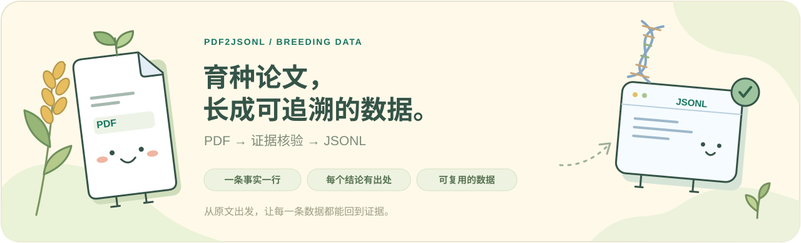
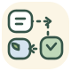
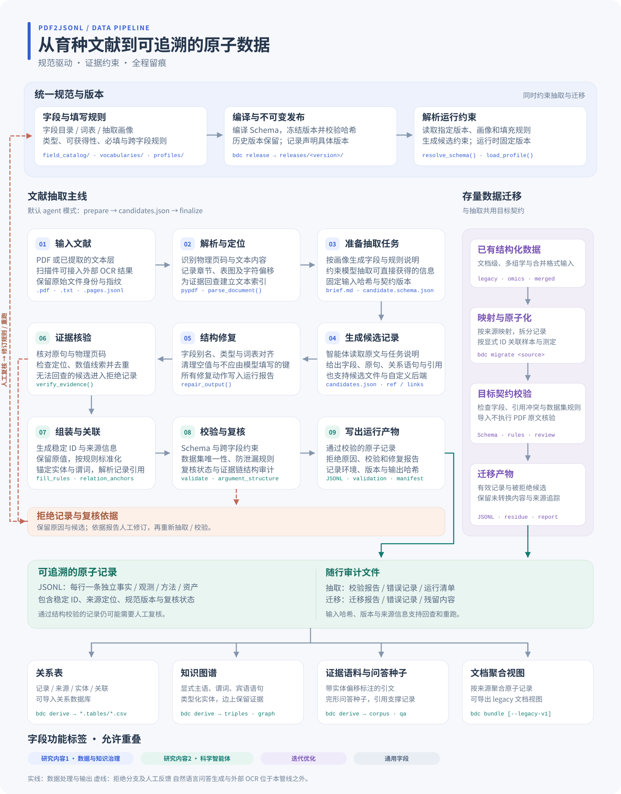

# 🌾 pdf2jsonl

**简体中文** | [English](README.en.md)



从一篇育种论文出发，整理出**有原文证据、字段含义明确、能够回查的 JSONL 数据**；同一份数据再直接派生出
知识图谱、语料、问答种子和关系表。本仓库维护育种文献数据契约，并提供抽取、校验、导入和派生工具。

<table>
<tr>
<td align="center" width="25%">
<a href="https://atoz03.github.io/pdf2jsonl/papers.html"><br><strong>论文看板</strong></a><br><sub>看论文，也看每次运行</sub>
</td>
<td align="center" width="25%">
<a href="https://atoz03.github.io/pdf2jsonl/#fields"><br><strong>字段图鉴</strong></a><br><sub>含义、功能标签与示例</sub>
</td>
<td align="center" width="25%">
<a href="https://atoz03.github.io/pdf2jsonl/pipeline.html"><br><strong>管线地图</strong></a><br><sub>从 PDF 到原子记录</sub>
</td>
<td align="center" width="25%">
<a href="#quick-start"><br><strong>开始抽取</strong></a><br><sub>用一篇论文跑起来</sub>
</td>
</tr>
</table>

> 🌱 仓库负责数据规范，Skill 负责抽取流程，每条记录都带着它的出处。

**所有内容都在一个站点里：** [https://atoz03.github.io/pdf2jsonl](https://atoz03.github.io/pdf2jsonl/) 由 `scripts/make_site.py`
根据最新发布版本和仓库内的示例生成，随 `main` 分支自动部署。

| 页面 | 内容 |
| --- | --- |
| [规范总览](https://atoz03.github.io/pdf2jsonl/) | 论文与存量数据如何变成记录，记录如何供下游使用；版本、字段组、规则概况 |
| [字段目录](https://atoz03.github.io/pdf2jsonl/#fields) | **404 个字段**：含义、类型、JSON 示意、键角色、服务功能、功能分类标签（可多选）和来源 |
| [抽取演示](https://atoz03.github.io/pdf2jsonl/#demo) | 合成论文从 PDF 到 JSONL 的全过程：候选、证据核验、记录、证据链审计 |
| [下游派生](https://atoz03.github.io/pdf2jsonl/#downstream) | 同一批记录派生出的关系语句、知识图谱、带标注的语料、问答种子和关系表 |
| [论文看板](https://atoz03.github.io/pdf2jsonl/papers.html) | 按论文查看 PDF、每次运行的记录、原文证据、复核问题，并下载结果 |
| [存量导入](https://atoz03.github.io/pdf2jsonl/#importers) | legacy、omics、merged 三种已有格式的导入器：映射覆盖、示例运行、问题登记 |
| [数据管线](https://atoz03.github.io/pdf2jsonl/pipeline.html) | 管线全景图，支持中英文切换与 SVG 下载 |

本地预览执行 `make site`，然后打开 `_site/index.html`。`make dashboard` 另外生成一个不入库的
`dashboard.html`，会把本地 `out/` 等运行目录里的论文和运行也收进来。

## 🧭 一次抽取，多种下游

```
论文 PDF ── pdf2jsonl ──┐                          ┌─► 关系语句 · 三元组 · 属性图（知识图谱）
                        ├─► 记录（JSONL，带钩子）──┼─► 带实体偏移标注的语料
已有数据 ── bdc migrate ┘        bdc derive        ├─► 完形问答种子
                                                   └─► 关系表（CSV）
```

记录不是抽取结果的容器，而是下游共用的中间格式。知识图谱要三元组，记录里就有显式的主语、谓词、宾语；
语料和问答要知道实体在原文的位置，记录里就有每个实体提及的字符偏移和它在关系中的角色。下游不必对原文
再解析一遍：

- **模型只抄写**：关系的主语、谓词原文、宾语三段逐字文本（`transform.subject_mention`、
  `predicate_mention`、`object_mention`）。
- **管线来计算**：实体类型、实体与谓词在引文中的偏移、主宾语角色（`transform.entity_links`、
  `predicate_start_offset`／`predicate_end_offset`），以及由线索词表确定性得到的关系代码（`predicate_code`）。
- **人工与下游再补充**：审核后的谓词、实体对齐、自然语言问答，各有对应字段，不与抽取结果混写。

记录没有的钩子，派生结果里就没有对应的行，不做猜测。设计说明见 [`docs/downstream.md`](docs/downstream.md)。

## 🧬 数据管线全景

[](docs/diagrams/pipeline.svg)

[HTML 图源](docs/diagrams/pipeline.html) · [SVG 原图](docs/diagrams/pipeline.svg) · [架构说明](docs/architecture.md)

图中包含 PDF 抽取主线、存量数据导入支线、拒绝记录与人工复核回路，以及关系表、知识图谱、证据语料与问答种子、
文档聚合输出。HTML 支持中英文切换和 SVG 下载；修改图源后运行 `make diagram` 可重新导出。

## 📚 仓库内容

| 路径 | 用途 |
| --- | --- |
| `field_catalog/field_catalog.yaml` | **规范源文件**：字段、类型、可获得性代码、规则及歧义登记 |
| `vocabularies/` | 受控词表及确定性的单位换算表 |
| `profiles/` | 面向不同用途的字段选择：`full`、`compact`、`pdf_extraction`、`pdf_extraction_omics` |
| `releases/` | 冻结且经过哈希校验的规范版本；`index.json` 维护 `latest` 指针 |
| `schemas/meta/` | 字段目录、词表、画像及映射等源文件的 JSON Schema |
| `schemas/runtime/` | 运行输出的 JSON Schema：清单、校验报告、错误记录、文档包及迁移报告 |
| `mappings/` | 各种已有数据格式到当前规范的逐叶映射及问题登记，供 `bdc migrate` 使用 |
| `sources/` | 不可变的原始输入，详见 [`sources/SOURCES.md`](sources/SOURCES.md) |
| `src/breeding_contract/` | 编译、发布、版本解析、校验、导入、打包、派生及审计工具（`bdc` CLI） |
| `skills/pdf2jsonl/` | Skill 说明、抽取任务模板及运行入口 `scripts/pdf2jsonl` |
| `docs/` | 架构、版本、来源分析、导入、下游派生及字段功能说明；`docs/generated/` 由源文件生成（含[字段定义与示例](docs/generated/field_definitions.md)） |
| `docs/field_examples.yaml` | 逐字段维护的示意值，用于生成和校验字段定义文档 |
| `docs/field_classification.yaml` | 逐字段功能标签：研究内容1、研究内容2、迭代优化、通用字段，支持多选 |
| `scripts/make_site.py` / `site/` | 站点生成器与页面模板：规范浏览、论文看板（`scripts/make_dashboard.py`）、下游派生、导入器 |
| `examples/` | 合成论文、整理后的记录、管线输出、导入输出及无效数据示例 |
| `tests/` | pytest 测试：规范一致性、版本、校验、管线、Skill 同步、导入、文档包、功能、证据链、下游钩子及站点 |

## 🔬 规范概览（3.4.0）

- 共 404 个字段，分为五组：`common` 177、`agent` 57、`skills` 53、`transform` 49、`omics` 68。
  v3.0.0 的 259 个字段标记为 `verified`，定义逐字保留；其后新增的 145 个字段标记为 `provisional`。
- **功能分类支持多选**：研究内容1、研究内容2、迭代优化、通用字段。
- 每个字段说明**键角色**（`key_role`，共 25 类）和**服务功能**（`serves`）：课题二科学智能体、课题三技能、
  知识图谱／关系库／问答／语料／三元组派生，以及课题一规范迭代。课题二、三的字段还标注所属卡片，
  证据链字段标注 TRACE 对应的 Toulmin／Flavell 要素。来源明确说明的功能与仓库补充的功能分开标识，
  详见[字段功能说明](docs/field_functions.md)。
- 记录采用嵌套结构：`common.record_id` 对应 `{"common": {"record_id": ...}}`。
- 可获得性代码描述数据来源方式：**D** 直接抽取、**N** 标准化、**I** 人工判断、**G** 后续生成、**F** 未来来源；
  这些代码不是质量分数。必填代码：**Y** 必填、**C** 条件必填、**N** 可选。
- **缺失信息直接省略**，不写 `null`、空字符串、空数组或空对象。
- 每条记录包含 `common.schema_name`、`common.schema_version`、稳定的 `common.record_id`（`rec_` 加 32 位十六进制字符）、
  来源信息（`source_id`、`source_locator`；论文证据还需页码和原文引文）以及 `review_status`。
- 共 34 条跨字段规则：20 条错误级别、14 条警告级别。来源明确陈述的要求按错误处理，推断出的要求仅作警告。
- 38 项歧义记录在字段目录中（`AMB-001` 至 `AMB-038`），避免隐式决定未明确的含义。

查阅[在线字段目录](https://atoz03.github.io/pdf2jsonl/#fields)、[字段定义与示例](docs/generated/field_definitions.md)、[完整字段字典](docs/generated/field_dictionary.md)
（也提供 [CSV](docs/generated/field_dictionary.csv)，运行 `bdc generate --xlsx out.xlsx` 可导出 Excel）和
[按功能组织的字段表](docs/generated/field_functions.md)。

<a id="quick-start"></a>

## 🌱 快速开始

```bash
uv venv .venv && uv pip install --python .venv/bin/python -e '.[dev]'   # 或：pip install -e '.[dev]'
make check        # bdc check --strict
make test         # pytest
```

### 🧪 抽取论文（agent 模式）

```bash
skills/pdf2jsonl/scripts/pdf2jsonl paper.pdf --profile pdf_extraction --schema-version latest --out-dir out/
# 退出码 3：out/paper.work/ 中已生成 brief.md、pages.txt、candidate.schema.json、request.json
# 按 brief.md 编写 out/paper.work/candidates.json，然后再次运行同一命令：
skills/pdf2jsonl/scripts/pdf2jsonl paper.pdf --profile pdf_extraction --schema-version latest --out-dir out/
```

输出包括 `paper.jsonl`（记录）、`paper.validation.json`（校验报告）、`paper.errors.jsonl`（被拒绝的候选，
不会写入正式记录）和 `paper.manifest.json`（规范标识、输入哈希、后端、环境及输出哈希）。
加上 `--bundle` 还会输出 `paper.bundle.json`。校验报告中的 `argument_structure` 提供证据链审计：
哪些结论关联了数据和方法，哪些限定措辞或关联尚未补全。其他接入方式包括 `--candidates file.json`、
`--backend mock` 和 `--backend module:callable`。

在本仓库使用 Claude Code 时，`.claude/skills/pdf2jsonl` 已链接到 `skills/pdf2jsonl`。
用户级安装可将 `~/.claude/skills/pdf2jsonl` 软链接到同一目录。

### Python API

```python
from breeding_contract import resolve_schema, load_profile, load_field_catalog, validate_record

rc = resolve_schema("latest")                  # 也可指定 "3.0.0" 或 "dev"（未发布的工作目录）
profile = load_profile("pdf_extraction", "latest")
catalog = load_field_catalog("3.4.0")
result = validate_record(record)               # 按记录声明的版本校验
result.valid, [i.to_dict() for i in result.errors]
```

### `bdc` 命令行

| 命令 | 用途 |
| --- | --- |
| `bdc check [--strict]` | 检查字段目录、画像、版本、文档、示例、映射及 Skill 的一致性 |
| `bdc generate [--xlsx F]` | 根据字段目录和文档示例重新生成 `docs/generated/` |
| `bdc release` | 将工作目录规范冻结到 `releases/<VERSION>`，需先填写 CHANGELOG |
| `bdc resolve [--schema-version V] [--profile P]` | 输出版本标识，默认 `latest` |
| `bdc validate FILE.jsonl` | 按每条记录声明的版本校验，并执行数据集级规则 |
| `bdc diff A B` | 比较两个版本的字段差异 |
| `bdc migrate legacy\|omics\|merged F --out DIR [--page-offset N]` | 把已有数据导入为原子记录，见[导入已有数据](#import) |
| `bdc bundle F.jsonl [--legacy-v1]` | 从原子记录派生文档级视图，或 legacy v1 布局 |
| `bdc derive F.jsonl --out DIR` | 派生关系表（CSV）、关系语句、三元组与属性图、带标注的语料和问答种子 |
| `bdc audit F.jsonl [--json]` | 审计证据链的 Toulmin／Flavell 要素、引用闭合及复核标记，不生成分数 |

## 🌿 修改规范

1. 编辑 `field_catalog/field_catalog.yaml`，按需更新词表和画像。保留来源引用，新增语义标记为 `provisional`，未决问题登记为歧义。
2. 根据 [`docs/versioning.md`](docs/versioning.md) 更新 `VERSION`，并填写 `CHANGELOG.md`。
3. 在 `docs/field_examples.yaml` 中补充或更新示意值，并在 `docs/field_classification.yaml` 中填写功能标签；规范名称和版本的示例自动生成。
4. 运行 `bdc generate && bdc release && bdc check --strict && pytest`。生成时会检查每个字段都有示例，且示例符合对应字段的 Schema。
5. Skill 无需手工修改：下次运行会解析 `latest` 并据新版本生成抽取任务说明。
   如果 Skill 硬编码字段路径或版本，或未实现画像所需的填充规则，`bdc check` 会报错。

<a id="import"></a>

## 🌾 导入已有数据

已经按其他格式整理的数据通过导入器进入同一份契约，不另设第二套 Schema。每个导入器对应一份逐叶映射
（`mappings/`），产出与抽取结果相同的原子记录，并经过同样的校验。

| 命令 | 输入 | 示例 |
| --- | --- | --- |
| `bdc migrate legacy` | 一篇论文一行的文档级 JSONL | `sources/legacy_v1/breeding_jsonl_example.jsonl` |
| `bdc migrate omics` | 多组学元数据模板的填写实例 | `examples/migration/omics_v2/synthetic_deg_instance.json` |
| `bdc migrate merged` | 文档加观测、样本、测定和资产数组，按显式 ID 关联 | `sources/merged_v2/breeding_jsonl_example_v2.json` |

```bash
bdc migrate merged sources/merged_v2/breeding_jsonl_example_v2.json --out out/merged --page-offset 2220
```

`--page-offset` 把出版页码换算成 PDF 物理页；`2220` 只适用于这个示例，已是物理页码时填写 `0`。
三个导入器的输出一致：有效记录、被拒绝的候选及原因、未转换内容（残留）和带哈希的迁移报告，不静默丢弃，
也不为凑必填项而补造。导入的记录一律为 `pending_review`。说明见[导入与派生视图](docs/migration.md)，
各来源的差异与取舍见[来源分析](docs/source_analysis.md)。

## 🗂 文档导航

- [下游派生设计](docs/downstream.md)：记录作为中间格式，下游需要的钩子，`bdc derive` 的各项输出。
- [字段定义与 JSON 示例](docs/generated/field_definitions.md)：由源文件生成的全部字段参考。
- [架构说明](docs/architecture.md)：组件、数据流、管线阶段及不变量。
- [版本管理](docs/versioning.md)：语义化版本、发布、`latest`／`dev` 与兼容性。
- [来源分析](docs/source_analysis.md)：各套源设计、差异及合并决策。
- [导入与派生视图](docs/migration.md)：三个导入器、映射文件，以及 `document_bundle`、`bdc derive`。
- [字段功能设计](docs/field_functions.md)：键角色、四项功能、卡片、证据链（TRACE）、派生视图及审计。
